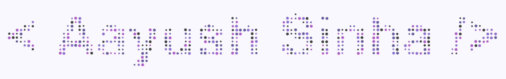

<a href="https://yush.dev"></a>

# yush.dev | Landing page


[](LICENSE)

Didn't come from the Website, I suggest go check out the website [https://yush.dev](https://yush.dev). Visited? Cool. Now go back to that website and open your Developer console, you can use the shortcut <kbd>Option</kbd>+<kbd>⌘</kbd>+<kbd>J</kbd> (on macOS), or <kbd>Shift</kbd>+<kbd>CTRL</kbd>+<kbd>J</kbd> (on Windows/Linux) on that site and maybe that will impress you.

Anyway, here are some things you might want to do next.

## Project Structure

```
├── src/                  # Website source files
│   ├── index.html        # Landing page
│   ├── connect.html      # LinkedIn redirect
│   ├── privacy/          # Privacy policy page
│   └── assets/           # Static assets
│       ├── css/
│       ├── js/
│       ├── fonts/
│       └── images/
├── docker/               # Docker and Nginx config
│   ├── Dockerfile
│   └── nginx.conf
├── .github/              # GitHub Actions workflows
├── LICENSE               # MIT License
├── CONTRIBUTING.md       # Contribution guidelines
└── SECURITY.md           # Security policy
```

## Get the Particle Text JS so you can use it on your site

The library I am using is called `particleText.js` and it can be found on [this GitHub Repository](https://github.com/aayusharyan/particleText.js). Please note, it is heavily under beta and might need some time before it is production ready. But I am trying to speed up the process (specially on Weekends). Feel free to contribute.

## Running Locally

Open `src/index.html` directly in a browser, or use Docker:

```bash
docker build -f docker/Dockerfile -t yush-dev .
docker run -p 8080:80 yush-dev
```

## Reach out to me

I am Aayush Sinha, (you must be knowing that by now, lol). You can connect with me on the following platforms. (I'd recommend to start with GitHub, the first link).

<a href="https://github.com/aayusharyan/"></a> &nbsp;
<a href="https://www.linkedin.com/in/aayushsinha/"></a> &nbsp;
<a href="https://aayusharyan.medium.com/"></a> &nbsp;
<a href="https://www.instagram.com/yush.dev/"></a> &nbsp;
<a href="https://www.youtube.com/aayushsinhaofficial"></a>

## Report an issue

I have tried to support and optimize this on many browsers including Internet Explorer. In fact, I am also handling situations when the devices are not that fast and based on the device speed, I am adjusting the animation speed and quality. I am trying to ensure a smooth 60fps (It looks awesome at 120+ fps) for the animations, but because of the limited hardware I have, I can only test so much. If you find an issue or if it doesn't work (including the Developer console part) on your browser, then please create an issue on this repository.

> **ProTip:** It will be really helpful if you can also share the device information like the OS/Processor/GPU/RAM, etc.

## Contributing

Bug fixes and approved features only — see [CONTRIBUTING.md](CONTRIBUTING.md) for details. Please open an issue before submitting a PR.

## Stack used to make this website.

- HTML/CSS/JS (All Vanilla).
- ParticleText.js
- GitHub
- GitHub Pages - Mapped to the domain directly (That contains Continuous Deployment. i.e., I push to my repository and it is reflected on the website automagically).
- Google Domains.
- A lot of :heart:

## License

This project is licensed under the [MIT License](LICENSE).

---

<p align="center">That's all folks!</p>
